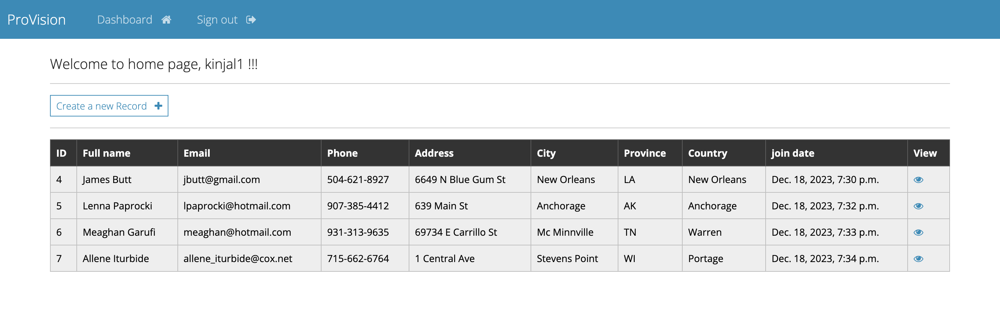

# Django CRM (Customer Relationship Management) App

## Description

Django CRM is an open-source Customer Relationship Management web application built using the Django framework. It helps businesses manage their customer interactions, streamline processes, and improve customer relationships.

## Features

- User authentication and authorization
- Customer and contact management
- Task management
- Dashboard for quick insights
- Responsive design for mobile and desktop

## Prerequisites

- Python 3.11.6
- Django 5.0
- Additional Python packages (see `requirements.txt`)

## Installation

1. Clone the repository:

   ```bash
   git clone https://github.com/KIN156/CRM-Django/
   cd CRM-Django
2. Create and activate a virtual environment (optional but recommended):
   ```bash
   python -m venv venv
   source venv/bin/activate  # On macOS/Linux
   venv\Scripts\activate  # On Windows

3. Install dependencies:
   ```bash
   pip install -r requirements.txt

5. Apply database migrations:
   ```bash
   python manage.py migrate

7. Create a superuser account:
   ```bash
   python manage.py createsuperuser

9. Run the development server:
    ```bash
   python manage.py runserver


Access the application at http://localhost:8000/ and log in with the superuser credentials.


## Screenshots




## Configuration
Update the SECRET_KEY in the config/settings.py file.

Customize the DEBUG setting based on your environment (set to False in production).

Configure database settings in config/settings.py.

## Contributing

Contributions are welcome!
